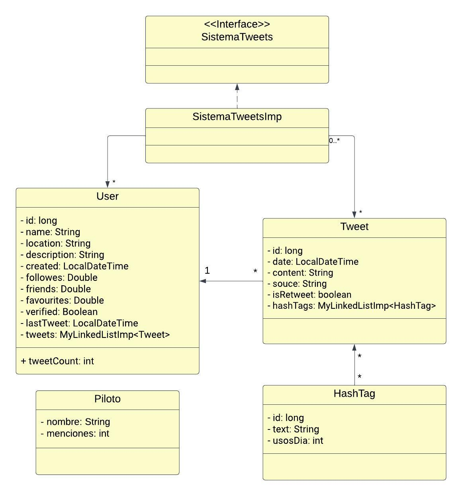

# Entrega Final Obligatorio   Programación II
### Tomás Bordaberry y Giao Giao Ma Tai
### 23.06.25

## Lector de CSV

En la clase están los métodos para leer el CSV y el archivo drivers.txt. Se cargan los Tweet, Hashtag y User en listas y/o hashtables para su uso posterior.
Se cargan también IDs automáticos de tipo long para Hashtag y User. Los HashTag se cargan también en una linkedList asociada a cada Tweet correspondiente,
y cada usuario tiene también una lista asociada de sus Tweet. Por otro lado, definimos un Binary Search Tree de Tweets, que utiliza como key la fecha en formato
LocalDateTimeWrapper, una clase diseñada por nosotros para poder utilizar los comparables de BST. Esto nos permite acceder a los tweet en orden log n por su fecha.

## FrontEnd

La clase FrontEnd tiene el despliegue del menú y el procesamiento de los parámetros ingresados por el usuario para su uso en las funciones. Para el
despliegue del menú se usó un switch-case, y los input y output se procesan adecuadamente para cada reporte.
Se incorporaron distintos mecanismos para manejar errores de input por parte del usuario.

## Main

La clase Main llama a las funciones CSV.getDrivers() y CSV.getCsvInfo(), al igual que a la clase FrontEnd.
Ademas, se agrego una barra de proceso para mantener al usuario informado de que el CSV se esta cargando y el codigo funciona.

## Métodos de los reportes

Se encuentran en la clase SistemaTweetsImp, que implementa la interface SistemaTweets. Se cargan las listas de la clase CSV para su uso.

1. `pilotosMasMencionados()` lista los 10 pilotos más mencionados para un mes dado.
   Comenzamos tomando un la fecha solicitada, calculando la fecha siguiente y conviritiendo las fechas a una clase LocalDateTimeWrapper, que es comparable. Esto nos sirve para utilizar BST y una funcion getRange que creamos.
   La misma devuelve todos los nodos del arbol binario que estan entre esos dos valores. Nos devuelve una lista de tweets para el mes seleccionado. 
   Iteramos a traves de los pilotos y de la lista reducida de tweets. Para cada piloto tomamos con java regrex el nombre y apellido y buscamos dichos valores en el string de texto del tweet. Si aprece **tanto el apellido, como el nombre**, se le suma al counter de dicho piloto. 
   Cada piloto es agregado a un max heap auxiliar. Luego, obtenemos y eliminamos los primeros 10 elementos del heap sort. A su vez, el FrontEnd, no toma los valores que sean iguales a 0. Y solo muestra pilotos con más de una mencion. Si no hay pilotos con mencion, muestra un mensaje diciendo que no hay menciones para dicho periodo.

2. `usuariosMasTweets()` imprime los 15 usuarios registrados con mayor cantidad de tweets.
   Define una linkedList llamada top15usuarios donde se añaden los User en función de su cantidad de tweets. La clase user usa la función .tweetCount() para
   contar su cantidad de tweets. Recorre la lista usuarios y compara cada usuario u con los de top15usuarios. Si el u.tweetCount() es mayor al del top15usuarios,
   u se inserta antes usando el método de MyLinkedListImp .addIndex(index, value) que inserta en el indice dado, seguido de un break para que no se añadan duplicados.
   Si top15usuarios tiene menos de 15 elementos, se añade u al final, y si tiene más de 15 elementos (o sea 16), se elimina el último. Finalmente imprime cada
   usuario de la lista seguido de su cantidad de tweets y si este está verificado.

3. `cantidadHashtags()` imprime la cantidad de hashtags distintos usados en un día dado.
   Para esto define una linkedList hashTagsDia. Recorre los todos los tweets y si su fecha coincide con la dada, recorre sus HashTag asociados. Si el HashTag
   no está en hashTagsDia, se añade a esta lista y al contador. Al final, imprime el contador, correpondiente a la cantidad de hashtags distintos usados ese día.

4. `hastagMasUsado()` devuelve el HashTag más usado para una fecha dada, excluyendo #f1.
   Para este método se agregó un atributo usosDia a la clase Hashtag, que se resetea a 0 cada vez que se llama al método. Recorre los tweets para ese día, y suma
   a usosDia cada vez que se menciona un hashTag, excluyendo #f1. Aquel con mayor usosDia se guarda en una variable hTop, y se devuelve al finalizar.
   Se utiliza el binary search tree y el metodo getRange creado en BST, para obtener todos tweets que esten en la fecha selecionada. Luego se itera sobre esta lista reducida de tweets.

5. `usuariosMasFavoritos()` devuelve los 7 usuarios registrados con más favoritos.
   Ordena con .quicksort la lista usuarios en función de su cantidad de favoritos en forma decreciente e imprime los primeros 7 usuarios, seguidos de sus favoritos.

6. `cantidadTweetsPalabra()` devuelve la cantidad de tweets con una palabra o frase dada.
   Se define un contador mentionCount para la cantidad de menciones y se recorre la lista de tweets. Si la frase dada se encuentra en el contenido del tweet,
   se suma al contador. Al final, se devuelve dicho contador.

## Tests de velocidad y RAM  

**nota: se utiliza el test csv para medir la velocidad**  
Para medir la velocidad, tomamos el tiempo antes de comenzar cada test y al finalizar. 

En la carpeta de tests, en la clase SistemaTweetsImpTest, se obtienen la velocidad de ejecución y la RAM usada por cada método ejecutado. Esto se define con
start() y end(), para obtener la diferencia en tiempos y memoria entre el principio y el final de cada método.

## UML

